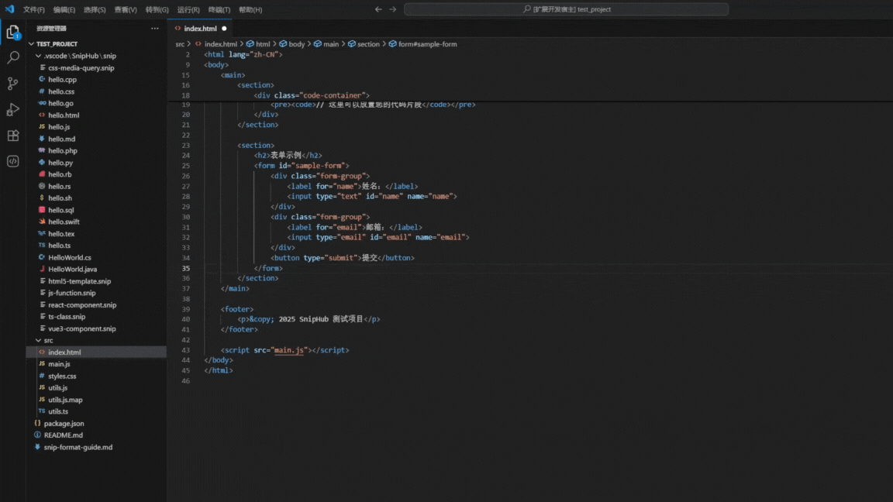
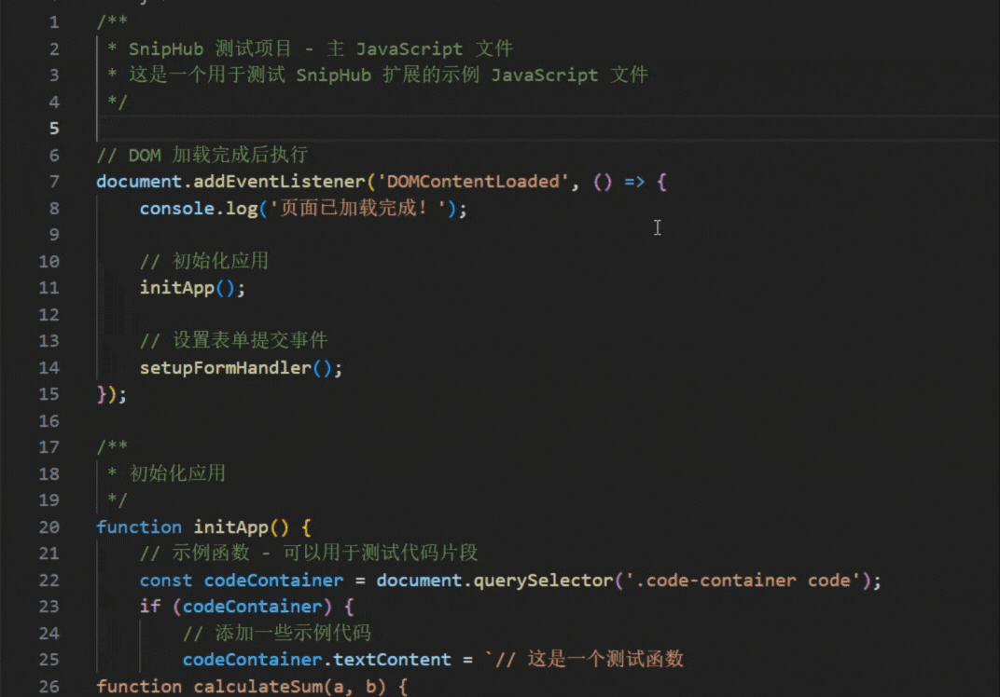

# SnipHub

[](https://marketplace.visualstudio.com/items?itemName=Frank6.sniphub) [](https://opensource.org/licenses/MIT)
[](https://dao404.github.io/SnipHub/)

**🌍 README:** [English](README.md) | [中文](README.zh-cn.md)

一个便捷的 VS Code 代码片段管理扩展，让您能够在项目目录中轻松定义和管理代码片段，通过智能代码补全提示实现快速调用。

尽管当前的 AI 代码生成工具发展已经能够满足一定程度的开发需求，但其生成的代码往往无法完全契合项目既定的架构设计和代码规范。为了防止代码质量下降和技术债务积累，我开发了这个项目。SnipHub 允许开发者在项目中预设符合规范的代码片段模板，在开发过程中按需调用，并可通过 Git 仓库与团队成员共享，从而实现标准化的代码复用和管理。

## 📺 演示

### 快速保存代码片段演示



---

### 代码片段应用演示



## ✨ 功能特点

- ✂️ **快速创建**: 从编辑器选中内容快速创建代码片段
- 🎯 **右键菜单**: 右键菜单快速操作
- 📂 **自动整理**: 自动分类存储到 `.vscode/SnipHub`
- 🔧 **快速应用**: 支持自定义前缀的代码补全提示快速应用代码片段
- 🏷️ **丰富元数据**: 支持标签和描述管理
- 🌍 **多语言支持**: 本扩展支持多种语言（英文、中文）
- 📝 **语法高亮**: 内置 .snip 文件语法高亮

## 🚀 快速开始

### 安装

1. 打开 VS Code
2. 进入扩展商店 (`Ctrl+Shift+X`)
3. 搜索 "SnipHub"
4. 点击安装

### 快速使用

#### 创建代码片段

1. 在编辑器中选择代码
2. 右键选择"SnipHub: 创建 .snip 文件"
3. 配置片段名称、描述、标签等

#### 应用片段
1. 在编辑器中输入预设前缀（默认sh）冒号即可看到可应用的片段列表
2. 选择需要应用到当前位置的目标片段即可

#### 管理片段
- 在 SnipHub 侧栏中查看所有片段和片段集
- 使用刷新按钮更新列表
- 通过设置按钮配置扩展

#### 创建片段集（开发中）
1. 点击活动栏的 SnipHub 图标
2. 点击"创建片段集"并配置名称、描述等
3. 通过资源管理器右键菜单添加文件到片段集


## 📖 使用指南

### 代码片段

支持各开发语言的代码文件内容直接补全到目标位置，也可自定义代码片段的专用格式 `.snip` 文件:

- **代码配置分离**：`set`标签为片段配置，`code`标签为代码片段
- **多语言支持**: 自动语言检测
- **自定义补全名称**: 使用可自定义片段名称触发
- **丰富的配置项**: 名称、描述、标签等

**已支持自定义项**

| 配置项名称 | 必填 | 描述 |
|:------|:------:|:------|
|name|是|代码片段名称|
|displayName|否|代码片段显示名称|
|description|否|代码片段描述|
|language|否|代码语言|
|tags|否|代码标签|
|updatedAt|否|更新时间|

更多陆续添加中...

**代码片段 `.snip` 文件示例:**

```snip
<set>
{
  "name": "hello-world",
  "displayName": "Hello World",
  "description": "创建一个简单的 Hello World JavaScript 代码",
  "language": "javascript",
  "tags": ["javascript", "基础", "示例"]
}
</set>
<code language="javascript">
function sayHello() {
  console.log("Hello, World!");
  return "Hello, World!";
}
sayHello();
</code>
```

## ⚙️ 配置选项

通过 `Ctrl+,` 进入设置并搜索 "SnipHub":

| 设置项 | 默认值 | 描述 |
|---------|---------|-------------|
| `sniphub.storageLocation` | `.vscode/SnipHub` | 片段存储位置 |
| `sniphub.prefix` | `sh` | 代码补全前缀 |

## 🛠️ 开发

### 前置要求

- Node.js 16.x 或更高版本
- VS Code 1.74.0 或更高版本

### 设置

```bash
# 克隆仓库
git clone https://github.com/dao404/sniphub.git
cd sniphub

# 安装依赖
npm install

# 编译 TypeScript
npm run compile

# 监听文件变化
npm run watch
```

### 构建

```bash
# 打包
vsce package

# 发布
vsce publish
```

### 测试

在 VS Code 中打开项目，按 `F5` 启动扩展开发主机窗口。

## 🌍 国际化

SnipHub 支持多种语言:

- **English** (默认)
- **中文** (简体中文)

扩展会自动检测您的 VS Code 语言设置并显示相应的语言界面。

## 📝 代码片段在项目中的文件结构

```
.vscode/SnipHub/
├── snip/              # 单个代码片段 (.snip 文件)
└── packs/             # 片段集 (代码片段集合配置文件)
```
## 🔗 相关链接

- [VS Code 扩展商店](https://marketplace.visualstudio.com/items?itemName=sniphub)
- [GitHub 仓库](https://github.com/dao404/sniphub)
- [问题追踪](https://github.com/dao404/sniphub/issues)
- [文档](https://github.com/dao404/sniphub/wiki)


## 📁 未来功能开发计划

- 支持由多个片段组合而成的片段集应用，包含应用配置及命令执行等
- MCP Server，提供项目的片段资源供AI工具调用
- 公共代码片段分发
- 欢迎通过issues提出发展建议

## 🤝 贡献

欢迎反馈项目问题或提交 Pull Request。

## 📜 许可证

此项目采用 MIT 许可证 - 详情请参阅 [LICENSE](LICENSE) 文件。

## Star History

[](https://www.star-history.com/#dao404/SnipHub&Timeline)

